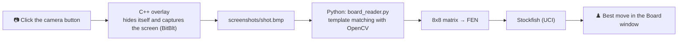

<div align="center">

# ♟️ Chess Board Reader

**Capture the screen. Recognize the board. Get the best move.**

A tiny Windows overlay that turns a screenshot into a chess position, completely offline,
with no neural network, then asks Stockfish what to play.


-00599C?logo=cplusplus&logoColor=white)


https://github.com/user-attachments/assets/e7840f55-637e-4b8d-a6d3-bc34ff32c4f0


</div>

---

## ✨ Features

- 📸 **One-click capture.** An always-on-top camera button grabs the screen in milliseconds and hides itself so it never appears in the shot.
- 🧠 **Offline board recognition.** Classic template matching with OpenCV. No internet, no neural network, no GPU.
- ♞ **Stockfish integration.** Optional; shows the best move in UCI format (`e2e4`) in a small *Board* window.
- 🎨 **Chess-themed setup window.** A Tkinter app that walks you through screenshot → calibration → piece templates.
- 🔄 **Automatic side detection.** Your color is detected from the king's position, so there is nothing to switch.
- 🪶 **Lightweight.** The overlay is a single native `.exe` with no runtime that uses almost no memory while idle.

## 🧩 How it works



The project has two parts:

| Part | Tech | Role |
|---|---|---|
| **Overlay** | C++ / Win32 / GDI+ | Always-on-top camera button, fast screenshot, launches Python and reads its output through a pipe |
| **Setup window** (`app.py`) | Python / Tkinter | One-time setup: screenshot, board calibration, piece templates. It can also launch the overlay |

<details>
<summary><b>Why C++ for the overlay?</b></summary>

<br>

- **Direct Win32 access.** A borderless always-on-top window (`WS_EX_LAYERED | WS_EX_TOPMOST`) with a transparent color key is a Windows-specific concept. C++ talks to `user32.dll` and `gdi32.dll` with no wrapper in between.
- **Fast capture.** `BitBlt` with `CAPTUREBLT` copies the screen's device context straight into memory. A full 1080p capture takes milliseconds, so the button can hide, capture and reappear without flicker.
- **Tiny and self-contained.** One `.exe`, no runtime to install, starts instantly.
- **Responsive UI.** The overlay repaints on hover and click through the standard message loop (`WM_PAINT`, `WM_MOUSEMOVE`, `WM_LBUTTONUP`).
- **Clean process boundary.** Recognition and engine calls are slow batch jobs that are much more convenient in Python (OpenCV, NumPy, the UCI text protocol). The overlay spawns Python as a short-lived child process, so the button stays responsive however long analysis takes.

</details>

## 📁 Project structure

```
Chess cheat/
├── src/
│   ├── main.cpp             # overlay entry point
│   ├── screenshot.cpp       # overlay button, screenshot, launches Python
│   ├── screenshot.h
│   ├── app.py               # setup window (screenshot, calibration, templates, launcher)
│   ├── board_reader.py      # board recognition + Stockfish query
│   ├── board_config.json    # created by app.py (board position, settings)
│   └── templates.npz        # created by app.py (piece templates)
├── screenshots/
│   └── shot.bmp             # created on every screenshot
├── engine/
│   └── stockfish.exe        # downloaded separately
├── Chess cheat.sln
└── Chess cheat.vcxproj
```

> [!NOTE]
> The overlay looks for its files in `Desktop\Chess cheat\` (see `InitPaths` in `screenshot.cpp`). Keep the project there or change that path.

## 🚀 Quick start

### 1. Requirements

| Tool | Notes |
|---|---|
| **Visual Studio 2019+** | With the *Desktop development with C++* workload |
| **Python 3.10+** | Added to `PATH` (check with `python --version`) |
| **Python packages** | `pip install pillow opencv-python numpy` |
| **Stockfish** *(optional)* | Download from [stockfishchess.org](https://stockfishchess.org/download/) (Windows, x86-64) and put `stockfish.exe` into `Chess cheat\engine\` |

### 2. Build the overlay

**Visual Studio**

1. Open `Chess cheat.sln`.
2. Make sure the project contains only `main.cpp`, `screenshot.cpp` and `screenshot.h`.
3. Choose `Release` and platform `x64`.
4. **Build → Rebuild Solution.** The `.exe` ends up in `x64\Release\`.

**Command line** (Developer Command Prompt for VS, inside `src`)

```bat
cl /EHsc /O2 main.cpp screenshot.cpp /Fe:overlay.exe /link /SUBSYSTEM:WINDOWS /ENTRY:mainCRTStartup
```

<details>
<summary>Hide the console window in a Visual Studio build</summary>

<br>

Put these two lines at the very top of `main.cpp`:

```cpp
#pragma comment(linker, "/SUBSYSTEM:WINDOWS")
#pragma comment(linker, "/ENTRY:mainCRTStartup")
```

Close the overlay before rebuilding, otherwise the linker cannot overwrite the `.exe`.

</details>

### 3. One-time setup

Piece templates are tied to a specific board color scheme and piece style. If you change the theme or the site, repeat these steps.

```bat
cd src
python app.py
```

| Step | Action |
|---|---|
| **1. Take screenshot** | Open a game at the **starting position** and press the button. The window hides itself while the screen is captured. |
| **2. Calibrate board** | Drag a square exactly along the outer edges of the squares (no frame, no coordinates). The red 8x8 grid shows how it lines up. Arrow keys move the selection by 1 px, `+` / `-` resize it. Tick the checkbox if white is at the bottom, then press **Accept**. |
| **3. Build piece templates** | The log lists all 12 pieces: `bB bK bN bP bQ bR wB wK wN wP wQ wR`. |

A check mark next to a step means it is done.

## 🎮 Usage

1. In the setup window choose **Move for**:
   - **my side (auto)**: your color is detected from the king's position;
   - **White** / **Black**: a fixed color.
2. Press **Launch overlay button** and select the overlay `.exe` the first time (the path is remembered). The setup window minimizes so it stays out of screenshots.
3. Open a game and click the **camera button** in the top-left corner of the screen. It changes color while recognition is running.
4. The **Board** window shows Stockfish's best move (or an error message).
5. **Right-click** the button to close the overlay. The setup window comes back.

There is also a **Test: screenshot + best move** button that does the same thing without the overlay.

### Reading the result

The best move is printed in UCI format: `e2e4` means move the piece from `e2` to `e4`. A trailing letter (`e7e8q`) marks a pawn promotion: `q` queen, `r` rook, `b` bishop, `n` knight.

> [!WARNING]
> Castling rights and en passant cannot be known from a single screenshot, so the FEN sent to Stockfish assumes full castling rights and no en passant. That is fine for "best move right now" analysis, but in rare positions it can suggest an illegal castling move.

## ⚙️ Configuration

`src/board_config.json` is created and updated by `app.py`. Every key is optional.

| Key | Meaning |
|---|---|
| `box` | Board position on the screen: `[left, top, right, bottom]` in pixels |
| `start_white_at_bottom` | Whether white was at the bottom on the template screenshot |
| `turn` | `"me"` (auto, default in the setup window), `"w"` or `"b"` |
| `my_color` | `"auto"`, `"white"` or `"black"` (used for the 8x8 matrix) |
| `engine_path` | Path to `stockfish.exe` (default `..\engine\stockfish.exe`) |
| `movetime_ms` | How long Stockfish thinks, in milliseconds (default `1000`) |
| `overlay_exe` | Path to the overlay `.exe` used by the Launch button |

## 💻 Command line

```bat
python board_reader.py templates [shot.bmp]     :: build piece templates
python board_reader.py move [w|b] [shot.bmp]    :: best move; turn defaults to config
python board_reader.py [shot.bmp]               :: print the 8x8 matrix
```

## 🛠️ Troubleshooting

If the **Board** window (or the log in `app.py`) shows an error message:

| Message | Cause |
|---|---|
| `cannot start python` | Python is not on `PATH` |
| `Cannot open image` | `shot.bmp` is missing |
| `FileNotFoundError ... templates.npz` | Templates were not built (step 3 of the setup) |
| `Board recognition looks wrong (...)` | Templates don't match the current theme. Repeat the setup |
| `Engine not found` | `stockfish.exe` was not found. Check `engine_path` |

> [!TIP]
> The overlay button is still on screen after closing `app.py`? It is a separate process. Right-click the button, or end `overlay.exe` in Task Manager.

## ⚠️ Disclaimer

Using tools like this in rated games on chess.com, lichess and similar platforms violates their terms of service and can get an account banned. For reviewing finished games, working through puzzles offline, playing against bots or practice, this restriction doesn't apply. Use it responsibly.

---

<div align="center">

If you find the project interesting, a ⭐ on the repo is always appreciated.

</div>
